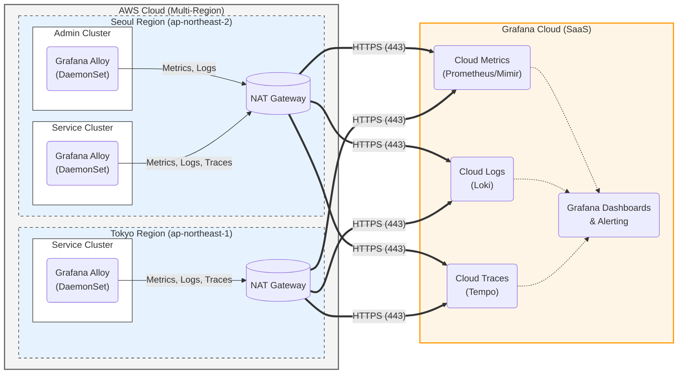

# Lionpay 모니터링 설계 문서 (Grafana Cloud Stack) (1)

## 1. 개요 (Overview)

본 문서는 **Lionpay** 서비스의 통합 모니터링 및 관측성(Observability) 확보를 위한 기술 스택과 아키텍처를 정의한다. 운영 복잡도 및 데이터 관리 부담을 최소화하기 위해 완전 관리형 서비스인 Grafana Cloud (SaaS)를 도입하며, **Grafana Alloy**를 통해 멀티 리전(서울, 도쿄)의 데이터를 안전하게 전송하는 것을 골자로 한다.

---

## 2. 모니터링 기술 스택 (Technical Stack)

| **구분** | **기술 요소** | **역할** |
| --- | --- | --- |
| **Collector / Agent** | **Grafana Alloy** | 노드 및 클러스터 레벨의 데이터 수집, 가공, 전송 (OTel 호환) |
| **Platform** | **Grafana Cloud** | 메트릭, 로그, 트레이스 통합 저장소 및 시각화 (SaaS) |
| **Metrics** | **Grafana Cloud Metrics** | 관리형 Prometheus (Mimir 기반) |
| **Logs** | **Grafana Cloud Logs** | 관리형 Loki |
| **Traces** | **Grafana Cloud Traces** | 관리형 Tempo |
| **Frontend Obs** | **Grafana Faro** | (선택 사항) 웹 프론트엔드 성능 및 에러 모니터링 |

---

## 3. 모니터링 아키텍처 (Direct-to-Cloud)

### 3.1. 데이터 흐름 (Data Flow)

각 클러스터가 인터넷을 통해 Grafana Cloud로 직접 데이터를 전송하는 구조이다.

1. **All Clusters (Admin/Seoul Service/Tokyo Service)**
    - 각 노드에 배포된 Alloy (DaemonSet)가 데이터를 수집한다.
    - 수집된 데이터는 각 리전의 **NAT Gateway**를 통해 Grafana Cloud Endpoint로 전송된다.
2. **Grafana Cloud**
    - 전 세계에서 전송된 메트릭, 로그, 트레이스를 중앙 저장하고 처리한다.
    - 통합 대시보드를 제공하여 단일 뷰(Single Pane of Glass)에서 전체 리전 상태를 모니터링한다.

### 3.2. 네트워크 통신

- **Egress Traffic**: 데이터 전송은 아웃바운드 인터넷 트래픽(**HTTPS/443**)을 사용한다.
- **PrivateLink**: 보안 강화가 필요할 경우 AWS PrivateLink를 사용할 수 있으나, 본 설계에서는 **표준 HTTPS 전송**을 기본으로 한다.

---

## 4. 데이터 수집 전략 (Collection Strategy)

### 4.1. 메트릭 (Metrics)

- **수집기**: Grafana Alloy (`prometheus.receiver`)
- **전송**: `prometheus.remote_write` 컴포넌트를 사용하여 Grafana Cloud의 `/api/prom/push` 엔드포인트로 전송
- **인증**: Grafana Cloud Access Policy Token을 사용한 **Basic Auth**

### 4.2. 로그 (Logs)

- **수집기**: Grafana Alloy (`loki.source.file`, `loki.source.kubernetes`)
- **전송**: `loki.write` 컴포넌트를 사용하여 Grafana Cloud의 `/loki/api/v1/push` 엔드포인트로 전송
- **가공**: 로컬 처리 단계에서 레이블(Label) 최적화 및 민감 정보 마스킹 수행 후 전송

### 4.3. 트레이싱 (Tracing)

- **Instrumentation**: OTel SDK (Java/DotNet), Local Alloy
- **전송**: `otelcol.exporter.otlp` 컴포넌트를 사용하여 Grafana Cloud의 Tempo 엔드포인트로 전송
- **샘플링**: 비용 제어를 위해 Alloy 단계에서 `probabilistic_sampler` 등을 사용하여 전송량 조절 권장

---

## 5. 클러스터별 배치 요소 명세 (Deployment)

모든 클러스터(Admin 포함)는 데이터 수집 에이전트만 구동하며 구성은 동일하다.

### 5.1. Grafana Alloy (DaemonSet)

- **Helm Chart**: `grafana/alloy`
- **설정 (config.river)**:
    - Grafana Cloud에서 발급받은 Stack ID, Usernames, Access Token을 **Kubernetes Secret**으로 주입
    - `clustering` 기능을 활성화하여 Kube-State-Metrics 등 중복 수집 방지

### 5.2. Admin 클러스터 (Seoul)

- **역할**: ArgoCD, ExternalDNS 등 관리 도구가 실행되는 클러스터
- **모니터링**: 서비스 클러스터와 동일하게 Alloy가 실행되어 클러스터 상태 및 ArgoCD의 메트릭/로그를 전송

---

## 6. 비용 및 제한 사항 관리 (Cost & Quota)

Grafana Cloud는 사용량 기반 과금(Active Series, Log GB, Trace GB) 방식이므로 최적화가 필수적이다.

1. **Metrics**: 불필요한 라벨(High Cardinality)을 Alloy 단계에서 드롭(`action = "drop"`)하여 Active Series 비용 절감
2. **Logs**: debug 레벨 로그 제외, info 이상만 전송하거나 특정 네임스페이스만 수집하도록 필터링
3. **Traces**: 운영 환경에서는 **10~20% 샘플링** 또는 **Tail-based Sampling** 적용 고려

---

## 7. 운영 및 알람 (Alerting)

- **Alert Rules**: Grafana Cloud Portal 내에서 Mimir/Loki/Tempo 룰을 정의하며, **Terraform 프로바이더**(`grafana/grafana`)를 통한 IaC 관리를 권장한다.
- **Contact Points**: Slack, PagerDuty, OpsGenie 등으로 알림 라우팅 설정.

---

## 8. 보안 고려 사항

- **Token 관리**: Grafana Cloud Access Token은 **AWS Secrets Manager** 또는 **Sealed Secrets**로 관리하고, 파드에는 환경 변수로 주입한다.
- **데이터 마스킹**: 결제 정보 및 개인정보는 클라우드 전송 전, Alloy 파이프라인 단계에서 반드시 마스킹 처리한다.

---

## 9. 아키텍처 다이어그램

